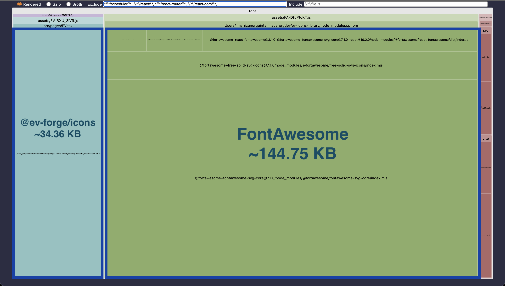
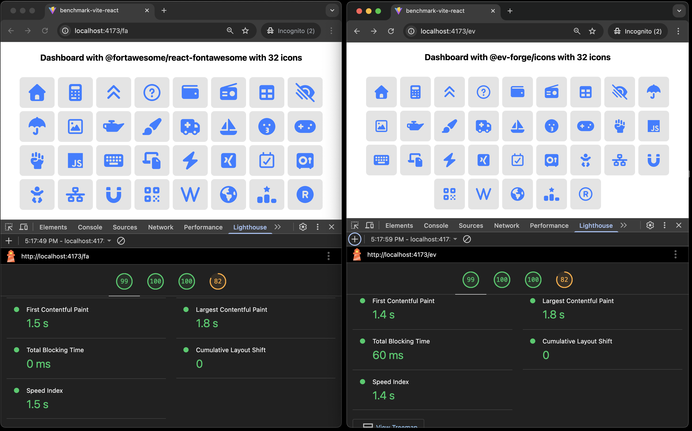

# Benchmark: Vite + React SPA

This app benchmarks the performance of `@ev-forge/icon-library` against `@fortawesome/react-fontawesome`.

It measures **Final Bundle Impact** (tree-shaking) and **Client Load Performance** (Lighthouse metrics) when rendering a set of 32 unique icons.

➡️ **Return to the main repository:** [github.com/es-forge/icon-library](https://github.com/ev-forge/icon-library)

---

## 📊 Results Summary

The following results were collected on [Date, e.g., October 2025] using Chrome 140.0.7339.133 on macOS. While exact numbers may vary, they demonstrate the significant performance difference between the two architectural approaches.

### Bundle Size Impact (via `rollup-plugin-visualizer`)

This measurement shows the total size of the library's modules included in the final production bundle after tree-shaking.

| Library                          | Bundle Size (gzip) | Reduction |
| :------------------------------- | :----------------: | :-------: |
| `@fortawesome/react-fontawesome` |      ~184 KB       |     -     |
| **`@ev-forge/icon-library`**     |     **~27 KB**     | **~85%**  |



### Client Load Performance (via Lighthouse)

These metrics reflect the perceived loading speed for the user on a simulated mobile device.

| Metric                             | `@fortawesome/react-fontawesome` | **`@ev-forge/icon`** |
| :--------------------------------- | :------------------------------: | :------------------: |
| **First Contentful Paint (FCP)**   |              1.5 s               |      **1.4 s**       |
| **Largest Contentful Paint (LCP)** |              1.8 s               |        1.8 s         |
| **Total Blocking Time (TBT)**      |             **0 ms**             |        40 ms         |



## How to Reproduce

All commands should be run from the monorepo root.

### 1. Build the App

This command generates the production build and creates a `dist/stats.html` file for bundle analysis.

```bash
pnpm --filter benchmark-vite-react build
```

### 2. Analyze the Bundle

Open the generated `dist/stats.html` file in your browser to visually inspect the size of each library in the final bundle.

### 3. Analyze Load Performance

Run the preview server and use your browser's DevTools to measure performance.

```bash
pnpm --filter benchmark-vite-react preview
```

Navigate to the `/ev` and `/fa` routes in **Incognito mode** and use the **"Network"** and **"Lighthouse"** tabs to collect metrics.
